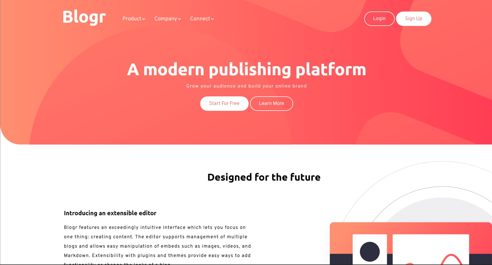

#Blogger Landing Page
___

##Overview

######This is a landing page of a site. It looks something like this.

___

##Technologies Used

* HTML
* CSS (vanilla)
* Javascript (Tiny bit of it.)

>The design of this project is inspired from a challenge on [frontend Mentor](https://www.frontendmentor.io/) and not my orginal. However the code for the design is written by me.